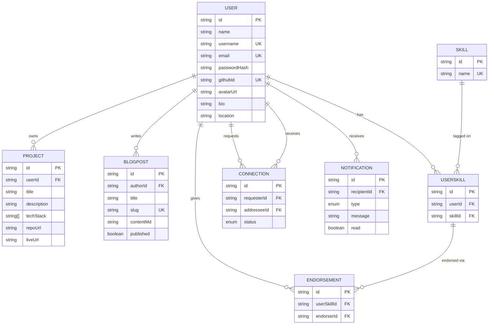

# Database Schema — DevConnect

Entity-relationship diagram for the schema defined in `server/prisma/schema.prisma`.
GitHub renders this Mermaid diagram automatically on the repo page.

## Notes on design decisions
- **`UserSkill` is a join table**, not a plain many-to-many, because endorsements attach to a *specific user's instance* of a skill, not the skill itself — that's what `Endorsement` references.
- **`Connection` is directional** (`requesterId` / `addresseeId`) with a `status` enum, so pending/accepted/rejected states and "who sent the request" are both recoverable from one row — matches the brief's send/accept/reject flow.
- **`Notification` stores `fromUserId` as a plain string, not a relation**, since notifications should survive even if we later want to prune old actor data independently; the recipient relation is what matters for querying "my notifications."
- Unique constraints (`@@unique([userId, skillId])`, `@@unique([requesterId, addresseeId])`, etc.) prevent duplicate endorsements / duplicate connection requests at the DB level, not just in application code.
