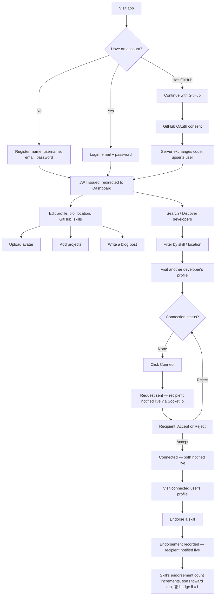

# User Flow Diagrams — DevConnect

Covers the core journey called out in the project brief: registration → profile → connect → endorse.

## Notes
- The **Connect → Accept → Endorse** chain is enforced server-side, not just hidden in the UI: `POST /api/endorsements/:username/:skillName` returns 403 if there's no `ACCEPTED` connection, regardless of what the frontend shows.
- Every live-notification step (request sent, accepted, endorsed) round-trips through `POST`-triggered `notifyUser()` → persisted `Notification` row → pushed over the recipient's socket if they're online, and is still visible via `GET /api/notifications` if they weren't.
